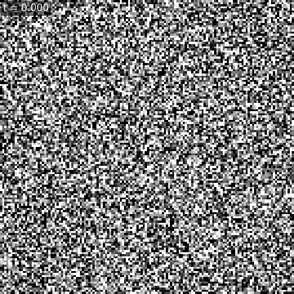
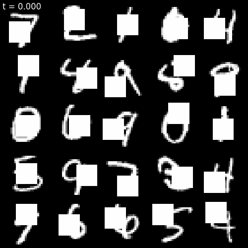

# ProbAI-public

---------------
## Directory structure

```
ProbAI-public
├── JN
│   ├── 🟩 c1.ipynb
│   ├── 🟩 c2.ipynb
│   ├── 🟩 c3.ipynb
│   ├── 🟩 cases_comparison.ipynb
│   └── training_comparison_all_cases.png
├── Project_report
│   ├── 🟦 WL_report.pdf
│   └── 🟦 dt8122_Project_Assignment_2025.pdf
└── code
    ├── Modules
    │   ├── Models
    │   │   ├── ModelWrapper.py
    │   │   └── Unet.py
    │   ├── Utils
    │   │   ├── DataLoader.py
    │   │   ├── dataClass_helpers.py
    │   │   ├── dataPlot_helpers.py
    │   │   ├── dt8122_snippets.py
    │   │   └── miscellaneous_helpers.py
    │   └──__init__.py
    ├── Modules.egg-info
    │   ├── PKG-INFO
    │   ├── SOURCES.txt
    │   ├── dependency_links.txt
    │   ├── requires.txt
    │   └── top_level.txt
    ├── 🟨 config
    │   ├── config_dynamic.py
    │   └── config_static.py
    ├── data
    │   ├── splits
    │   │   ├── mnist_probai_split.pt
    │   │   ├── mnist_probai_train_subset.pt
    │   │   └── mnist_probai_val_subset.pt
    │   ├── test
    │   │   └── MNIST
    │   │       └── raw
    │   │           ├── t10k-images-idx3-ubyte
    │   │           ├── t10k-images-idx3-ubyte.gz
    │   │           ├── t10k-labels-idx1-ubyte
    │   │           ├── t10k-labels-idx1-ubyte.gz
    │   │           ├── train-images-idx3-ubyte
    │   │           ├── train-images-idx3-ubyte.gz
    │   │           ├── train-labels-idx1-ubyte
    │   │           └── train-labels-idx1-ubyte.gz
    │   └── train
    │       └── MNIST
    │           └── raw
    │               ├── t10k-images-idx3-ubyte
    │               ├── t10k-images-idx3-ubyte.gz
    │               ├── t10k-labels-idx1-ubyte
    │               ├── t10k-labels-idx1-ubyte.gz
    │               ├── train-images-idx3-ubyte
    │               ├── train-images-idx3-ubyte.gz
    │               ├── train-labels-idx1-ubyte
    │               └── train-labels-idx1-ubyte.gz
    ├── data_processed
    │   ├── shufflePairings_False
    │   │   ├── cropBool_False
    │   │   │   └── valFrac_0.1
        ...  ...
        
    ├── models
    │   ├── shufflePairings_False
    │   │   ├── cropBool_False
    │   │   │   └── valFrac_0.1
        ...  ...

    ├── 🟥 pyproject.toml
    ├── 🟥 environment.yml
    ├── 🟧 generate_data.py 
    └── 🟧 simulate.py 
```

#### Key
- 🟩 = .ipynb for visualising model training &  **Results generation**
- 🟦 = Project Assignment (**Report**) files
- 🟥 = Files related to the **Code** set-up/implementation
- 🟨 = Set model & data parameters before training
- 🟧 = Execute model training
  
  
#### Notes
- The nested directories storing all the models (and the corresponding plots/gifs) are deep. This is due to a reasonable number of data and model
  related parameters the user can specify. Therefore, their full paths are omitted.


---------------
## Code 

### Set-up

0) start at your project root code file (same folder as pyproject.toml)
```
cd path/to/ProbAI-public/code
```

1) (one-time) ensure package is a regular package (not namespace)
```
mkdir -p Modules
[ -f Modules/__init__.py ] || touch Modules/__init__.py
```
2) create & activate a clean env and install packages
```
conda env create -f environment.yml
conda activate probAI
python -m ipykernel install --user --name probAI --display-name "probAI (Python 3.10)"
```
3) quick sanity check that THIS env sees your package directory
```
python - <<'PY'
import Modules, sys, importlib
print("Python:", sys.version.split()[0])
print("Modules file:", getattr(Modules, "__file__", None))
print("Modules path:", list(getattr(Modules, "__path__", [])))
print("matplotlib:", importlib.import_module("matplotlib").__version__)
try:
    import torch, torchvision
    print("torch:", torch.__version__, "| torchvision:", torchvision.__version__)
except Exception as e:
    print("Torch import error:", e)
PY
```

### Results generation
- After **Set-up** one can generate the models by:
 
(0) start at your project root (same folder as pyproject.toml)
```
cd path/to/ProbAI-public/code/
```

(1) Activate conda environment
```
conda activate probAI
```

(2) Generate training,validation and test data:
   execute
```
python generate_data.py
```

(3) Train a particular model configuration (c1, c2 or c3). For example, for c1:

   1) set "CASE = 1" in    `ProbAI-public/code/config/config_dynamic.py`
   2) execute simulation
      ```python simulate.py```

Notes:
- The data objects storing the training, validation and test data will automatically be created when executing `python
  simulate.py` in the `code/` directory. Unfortunately, these objects are to large to have stored on the remote directoy.
  Therefore, if step (3) will be completed then step (2) is redunant.  

- Pre-trained models are already available. The code will automatically load the model specified in the configuration files  
  (`config_dynamic.py` and `config_static.py`) with the highest number of trained epochs. The number of epochs corresponds to
  the point at which training stopped improving, as determined by *early stopping*.  Running the code again will train the 
  model by exactly the `early_stopping` number of epochs (without saving intermidate models and no improvements will occur).
  If any parameters in the `config/` directory are modified, a new model with the updated architecture will be trained (and
  intermediate models will be saved).
  
(4) Execute c1.ipynb/c2.ipynb/c3.ipynb for generating (and saving plots) corresponding to c1/c2/c3.

Note: If one runs skips (4) and simply runs the the ipynb notebooks in (3) the plots shown in the report will be formed.
(I.e., minimal steps to see the results are (0) - (2) inclusive and then (4)).
   
   
--------------------

## Report
The report pertaining to DT8122 Project Assignment can be found at `WL_report.pdf`. This is in relation to the DT8122 Project Assignment ('dt8122_Project_Assignment_2025`).

An overview of the results are displayed below in the form of gifs.

## Flow Matching Experiments
- In this project, three experimental configurations are explored, each differing in how the source and target pairs are constructed:
  - **Configuration 1 (C1):**
    - Source inputs: independent Gaussian noise images.  
    - Targets: clean MNIST digits drawn at random.  
    - Since the two sides come from unrelated distributions, there is no meaningful correspondence between them.  
    - Any given noise sample is effectively paired arbitrarily with a digit.
   
      


  - **Configuration 2 (C2):**
    - Source inputs: cropped versions of MNIST digits.  
    - Targets: the corresponding clean digits.  
    - There is a strong dependency between source and target, since they match outside the cropped region.  
    - However, pairings are assigned by random shuffling, so this natural dependency is not preserved.  
    - Cropped digits are (almost) always matched with the wrong clean digits, disrupting the learning process.

       
 
  - **Configuration 3 (C3):**
    - Source inputs: same cropped-noise sources as in C2.  
    - Targets: always paired deterministically with their true clean counterpart.  
    - This respects the underlying structure of the data and represents the ideal assignment between source and target.  

      
